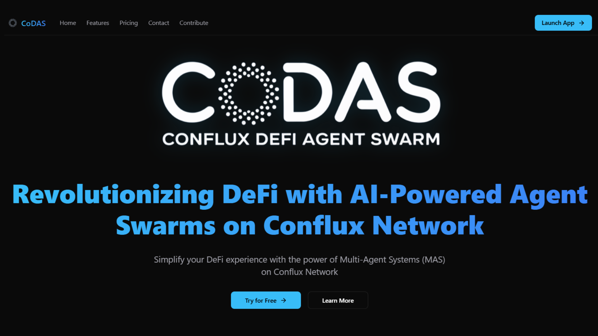

# CoDAS: Conflux DeFi Agent Swarm

<div align="center">
  
  <h3>Revolutionizing Conflux DeFi with AI-Powered Agent Swarms</h3>
  <p>Simplify your Conflux DeFi experience with the power of Multi-Agent Systems (MAS)</p>

  <p align="center">
    <a href="https://discord.gg/nu6gkDwEQy">
      
    </a>
    <a href="https://x.com/CoDASMemeWizard">
      
    </a>
  </p>
</div>

<div align="center">
  <h3>🏆 Conflux Network Project</h3>
</div>

---

## 📚 Table of Contents

- [🌟 Overview](#-overview)
- [✨ Features](#-features)
- [📖 Documentation](#-documentation)
- [🏗️ Project Structure](#️-project-structure)
- [🚀 Getting Started](#-getting-started)
- [💻 Web Client](#-web-client)
- [🛠️ Development](#️-development)
- [🤝 Contributing](#-contributing)
- [📄 License](#-license)

## 🌟 Overview

CoDAS (Conflux DeFi Agent Swarm) is an innovative open-source project that simplifies and automates interactions with the Conflux DeFi ecosystem through AI-powered agent swarms. Part of the broader AI Workforce Suite (AIWS), CoDAS demonstrates how collaborative AI agents can revolutionize DeFi workflows.

### Why Multi-Agent Systems (MAS)?

Our platform leverages a Multi-Agent System architecture where each agent specializes in specific tasks—from fetching metrics to executing trades—enabling modular, scalable, and efficient operations. This approach ensures:

- **🎯 Specialization**: Optimized performance through task-specific agents
- **📈 Scalability**: Easy addition of new agents and features
- **🛡️ Robustness**: Continued operation even if individual agents fail
- **⚡ Efficiency**: Parallel task execution for improved performance
- **🔄 Adaptability**: Seamless integration with new protocols and APIs


## ✨ Features

### Core Features

- 🤖 Natural language processing
- 💥 Multi Agent System including 10 AI Agents with different personalities, roles and skills.
- 🔅 Multiple Client Support: Web Client, API,Telegram, Discord, Twitter.
- 💰 Real time prices using CoinGecko API
- 🚀 Real time TVL using DefiLlama API
- 📝 Text generation and analysis
- 🎨 Image generation and description
- 🗣️ Speech synthesis and recognition
- 📊 Data visualization
- 🌐 Web browsing capabilities


### Conflux Features

- 💰 Wallet management (Core Space and eSpace)
- 💸 Token transfers (eSpace only). Supports CFX, USDT, BTC, WCFX, SCFX, SHUI, CODAS
- 🌉 Cross-space bridging from Core to eSpace
- 💱 Token swapping via Swappi DEX (eSpace only). Supports CFX, USDT, BTC, WCFX, SCFX, SHUI
- 💱 CFX Staking on Shui liquid staking protocol
- 🔍 Transaction tracking


## 🚀 Quick Start

### Prerequisites

- Node.js 23+
- pnpm 9+
- Git

### Installation

```bash
# Clone the repository
git clone https://github.com/BerEst12/codas
cd codas/eliza

# Install dependencies
pnpm install --no-frozen-lockfile

# Copy environment file
cp .env.example .env
```

### Configuration

Edit `.env` file and add your credentials:

```env
# Required for eSpace operations
CONFLUX_ESPACE_PRIVATE_KEY=your_private_key
CONFLUX_ESPACE_RPC_URL=https://evm.confluxrpc.com

# Required for Core Space operations
CONFLUX_CORE_PRIVATE_KEY=your_private_key
CONFLUX_CORE_RPC_URL=https://main.confluxrpc.com

# Choose an API provider and add the API_KEY on the env file (Choose one and configure it on the character file as well, openai is default)
OPENAI_API_KEY=                 # OpenAI API key, starting with sk-
ANTHROPIC_API_KEY=              # For Claude

# You can add additional clients by adding the env variables and including them in the character file like ["dicord","telegram"].
# Discord Configuration
DISCORD_APPLICATION_ID=
DISCORD_API_TOKEN=              # Bot token

# Telegram Configuration
TELEGRAM_BOT_TOKEN=

# Twitter/X Configuration
TWITTER_DRY_RUN=false
TWITTER_USERNAME=               # Account username
TWITTER_PASSWORD=               # Account password
TWITTER_EMAIL=                  # Account email
```

### Running the Agent

```bash
# Build the agent
pnpm build

# Start the coordinator agent
pnpm start --characters="characters\coordinator.character.json"

# Start all 10 agents
pnpm start --characters="characters/coordinator.character.json,characters/metrics-agent.character.json,characters/sales-agent.character.json,characters/meme-agent.character.json,characters/nfts-agent.character.json,characters/alpha-agent.character.json,characters/defi-agent.character.json,characters/trading-agent.character.json,characters/wallet-agent.character.json,characters/analyst-agent.character.json"
```

### Running the Web Client
In a new terminal, run the following command:

```bash
cd client
pnpm run dev
```
### Web Client Preview




## 🧪 How to use?

Interact with the agents with these example prompts:

### Network Information

```
What is Conflux Network?
```

### TVL Metrics

```
Get detailed TVL metrics for Conflux Network and global DeFi
```

### Price Metrics

```
Get prices for CFX, USDT, ETH, BTC
```

### Wallet Operations

```
Show me my Conflux Core wallet address and balance
```

```
Show me my Conflux eSpace wallet address and balance
```

### CFX Transfers

```
Send 0.0001 CFX to cfx:aan8atk01e3bprs411w2gy06c2frefyb4uy3bjm8zc on Core Space
```

```
Send 0.001 CFX to 0x092618c68f6A87615b02484adE2BC92D7716AB15 on eSpace
```

### Cross-Space Bridge

```
Bridge 0.00001 cfx from Conflux Core to Conflux eSpace to 0x092618c68f6A87615b02484adE2BC92D7716AB15
```

### Token Swaps

```
swap 0.001 CFX for USDT on Swappi DEX (eSpace)
```

```
swap 0.001 CFX for BTC on Swappi DEX (eSpace)
```

### Token Transfers

```
Send 0.00001 USDT to 0x092618c68f6A87615b02484adE2BC92D7716AB15 on eSpace
```

```
Send 1 CODAS to 0x092618c68f6A87615b02484adE2BC92D7716AB15 on eSpace
```

### Shui Staking

```
Stake 0.01 CFX on Shui
```

```
Unstake 0.0001 CFX from Shui
```

```
Claim available CFX from Shui
```

## 🔍 Important Notes

### Address Formats

- eSpace: Use `0x` addresses
- Core Space: Use `cfx:` addresses
- For private keys, use the private keys of the account you want to use making sure it starts with `0x` (Applies to both Core and eSpace).

- For bridging:
    - Core to eSpace: destination must be `0x` address
    - eSpace to Core: destination must be `cfx:` address

### Transaction Tips

- Always include enough CFX for gas fees
- Swaps have a default 0.5% slippage tolerance

## 🛠️ Development

### Project Structure

```
README.md                       # This file
docs/                           # Documentation
  ├── aiws.md                   # AI Workforce Suite docs
  ├── business-plan.md          # Business plan and strategy
  ├── overview.md               # Project overview
  ├── plan.md                   # Development roadmap
  ├── plugin-codas.md           # CoDAS plugin documentation
  ├── specs.md                  # Technical specifications
  └── whitepaper.md             # Project whitepaper
assets/                         # Assets
codas-token/                    # CoDAS Token Hardhat project
  ├── contracts/                # CoDAS Token contract
  │   └── CoDASToken.sol        # CoDAS Token contract
  └── README.md                 # CoDAS Token README
  ...

eliza/                          # Eliza project
  ├── packages/
  │   ├── core/                 # Eliza core functionality
  │   ├── plugin-conflux/       # Conflux integration
  │   │   ├── src/
  │   │   │   ├── actions/      # Blockchain operations
  │   │   │   ├── providers/    # Wallet providers
  │   │   │   ├── templates/    # Template functions
  │   │   │   ├── types/        # TypeScript definitions
  │   │   │   └── utils/        # Helper functions
  ├── plugin-codas/             # Conflux integration
  │   ├── src/
  │   │   ├── actions/      
  │   │   ├── providers/    
  │   │   │   ├── coingecko     # CoinGecko API
  │   │   │   ├── defillama     # DefiLlama API
  │   │   │   └── ...
  │   │   ├── templates/    
  │   │   ├── types/        
  │   │   └── utils/        
  └── client/                   # Web App
```

## 🤝 Contributing

1. Fork the repository
2. Create your feature branch
3. Commit your changes
4. Push to the branch
5. Create a Pull Request

## 📄 License

This project is licensed under the MIT License - see the [LICENSE](LICENSE) file for details.

---

<div align="center">
  <p>Built with ❤️ by the CoDAS team</p>
  <p>
    <a href="https://discord.gg/nu6gkDwEQy">
      
    </a>
    <a href="https://x.com/CoDasAgent">
      
    </a>
    </a>
  </p>
</div>